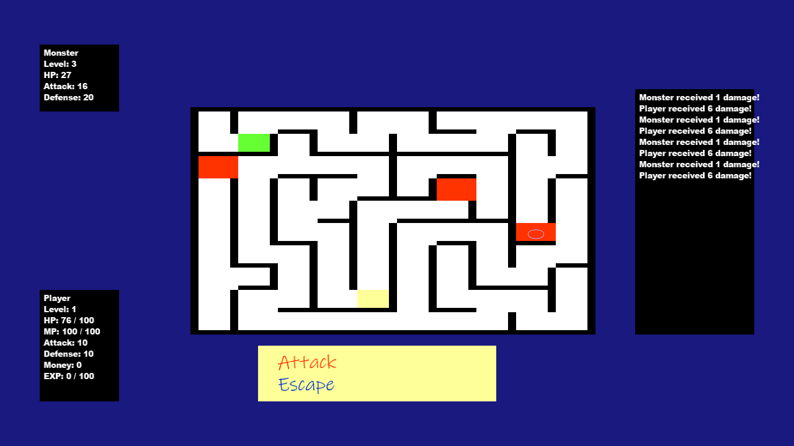

# Marry Princess

Author: Jiasheng Zhou \<jiashen2@andrew.cmu.edu\>

Design: 

In this game, you need to adventure in the maze and get enough money to marry the princess. There are treasure and monster in the cave. The maze, treasure and monsters are all random.

Text Drawing: 

All the text are generated as follows: the 2d textures for the text are generated once when you set the text using SetText method in DrawFont class. The shaping and position are calculated on each draw call. Each glyph is displayed by 4 vertexes containing the position and texture calculated before.

There is dialog and menu loading where .dialogs file contains all the static dialogs in the game and .showdialog file contains the initial dialogs shown in one scene.

Screen Shot:

How To Play:

W: Move player up / previous dialog\
A: Move player left\
S: Move player down / next dialog\
D: Move player right\
Enter: Confirm

Sources: 

This game was built with [NEST](NEST.md).

